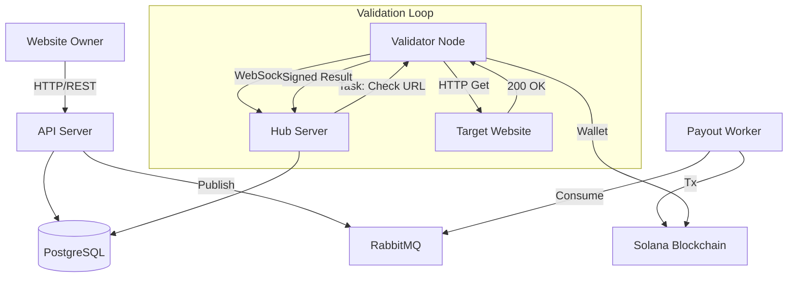

# User Flow and System Architecture

## Overview
Gopher Uptime is a decentralized uptime monitoring application where website owners can track the status of their websites, and validators can earn rewards for performing health checks.

## Actors
1.  **Website Owner (User)**: Wants to monitor their website's uptime and latency.
2.  **Validator (Node)**: A decentralized node that performs HTTP checks on websites.
3.  **Platform**: The central API and Hub that coordinates tasks and manages data.

## User Journey

### 1. Registration and Authentication
-   **User** visits the web app.
-   **User** signs up with email and password (`/api/v1/auth/signup`).
-   **User** logs in to receive a JWT authentication token (`/api/v1/auth/login`).

### 2. Monitoring Setup
-   **User** navigates to their dashboard.
-   **User** adds a new website URL to be monitored (`POST /api/v1/website`).
-   The **Platform** stores the website and marks it as active.

### 3. Validation Process (Backend Flow)
-   **Validators** connect to the **Hub** (WebSocket) using their unique Solana Private Key.
-   The **Hub** assigns validation tasks (website URLs) to connected Validators.
-   **Validators** perform HTTP GET requests to the target URL.
-   **Validators** sign the result (Status, Latency) with their private key and send it back to the **Hub**.
-   The **Hub** verifies the signature and stores the result (Tick) in the database.

### 4. Viewing Results
-   **User** views the dashboard list (`GET /api/v1/websites`).
-   **User** clicks on a specific website to see detailed history and charts (`GET /api/v1/website/status`).

### 5. Validator Payouts
-   **Validators** accrue pending rewards for every successful check.
-   **Validators** (or an automation script) request a payout (`POST /api/v1/payout/:validatorId`).
-   The **Platform** processes the transaction via RabbitMQ and settles on the Solana blockchain.

## System Architecture Diagram

